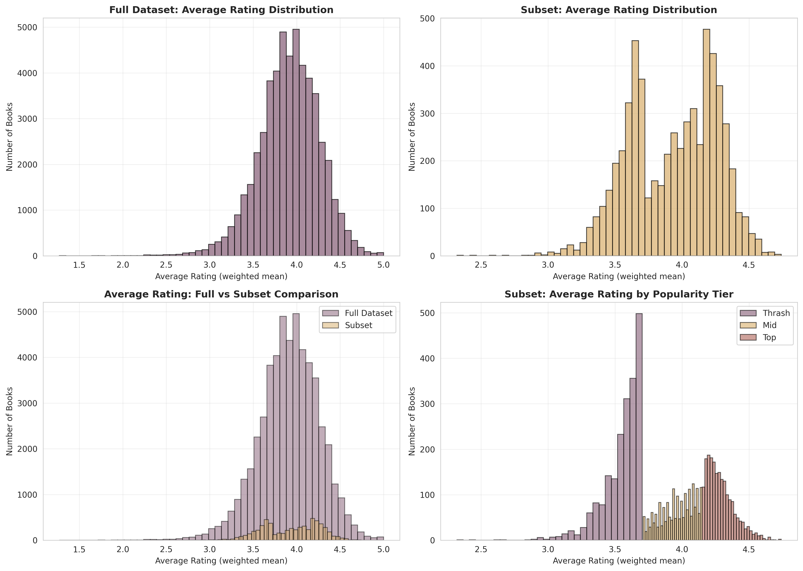
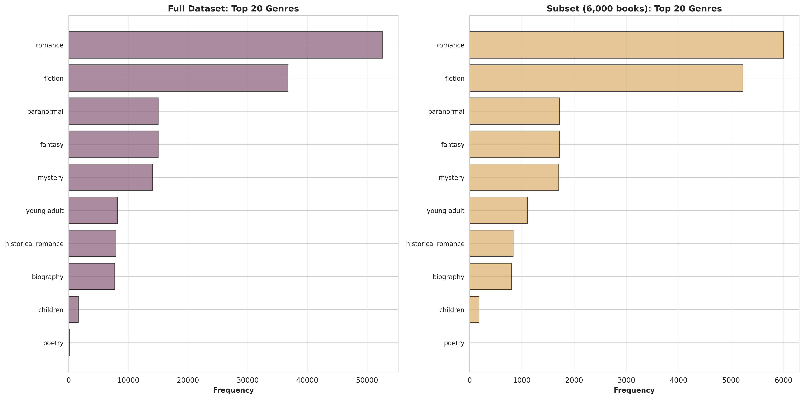
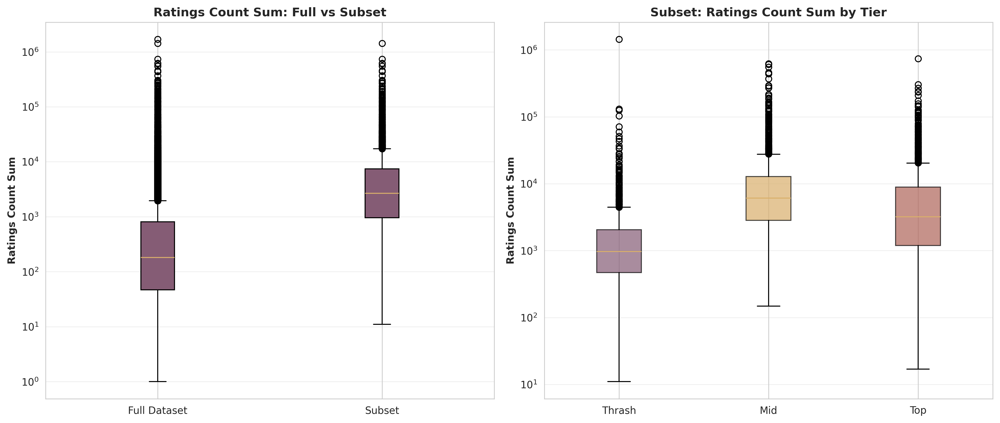

# Corpus Construction Statistical Analysis Report
**Generated:** 2025-11-13 20:44:48
---

## Executive Summary

This report presents comprehensive statistical analysis of the romance novel corpus construction, including exploratory data analysis (EDA) on the full dataset (52,585 books) and cross-corpus validation comparing the full dataset to the 6,000-book research subset.

## Full Dataset Characteristics

### Overview

- **Total Books:** 52,585
- **Total Authors:** 17,584
- **Total Series:** 35,469

### Publication Year

- **Range:** 2000 - 2017
- **Mean:** 2012.8
- **Median:** 2013.0
- **Standard Deviation:** 3.3
- **Quartiles:** Q1=2012.0, Q3=2015.0

### Average Rating (Weighted Mean)

- **Mean:** 3.913
- **Median:** 3.930
- **Range:** 1.270 - 5.000
- **Quartiles:** Q1=3.705, Q3=4.150

### Ratings Count (Sum across editions)

- **Mean:** 1,749
- **Median:** 182
- **Range:** 1 - 1,686,868

### Text Reviews Count (Sum across editions)

- **Mean:** 143
- **Median:** 32
- **Range:** 0 - 74,298

### Page Count (Median)

- **Mean:** 261.2
- **Median:** 256.0
- **Range:** 90 - 980

### Series Status

- **Standalone:** 17,116 (67.5%)
- **Series:** 35,469 (32.5%)

### Genre Distribution

- **Total Unique Genres:** 10
**Top 10 Genres:**

1. romance: 52,585 occurrences
2. fiction: 36,758 occurrences
3. paranormal: 15,017 occurrences
4. fantasy: 15,017 occurrences
5. mystery: 14,095 occurrences
6. young adult: 8,189 occurrences
7. historical romance: 7,943 occurrences
8. biography: 7,741 occurrences
9. children: 1,621 occurrences
10. poetry: 123 occurrences

## Cross-Corpus Validation

This section presents statistical comparisons between the full dataset and the 6,000-book subset to validate the representativeness of the research corpus.

### Statistical Test Results

| Test | Test Type | Statistic | p-value | Significant | Effect Size |
|------|-----------|-----------|--------|------------|-------------|
| genre_distribution | chi-square | 0.0114 | 1.0000 | No | nan |
| publication_year | chi-square (decade bins) | 2.0573 | 0.1515 | No | 0.0059 |
| publication_year_continuous | Mann-Whitney U | 155650108.0000 | 0.0875 | No | -0.0261 |
| series_status | chi-square | 1.7329 | 0.1880 | No | 0.0054 |
| average_rating_weighted_mean | Mann-Whitney U | 151898978.0000 | 0.0000 | Yes | -0.0607 |
| ratings_count_sum | Mann-Whitney U | 48396241.0000 | 0.0000 | Yes | -0.4150 |
| text_reviews_count_sum | Mann-Whitney U | 50955036.0000 | 0.0000 | Yes | -0.5650 |
| num_pages_median | Mann-Whitney U | 157508605.5000 | 0.8426 | No | -0.0051 |

### Key Findings

- ✅ **Genre distribution is statistically similar** between full dataset and subset (p >= 0.05)
- ✅ **Publication year distribution is statistically similar** (p >= 0.05)
- ✅ **Series status distribution is statistically similar** (p >= 0.05)
- ⚠️ **Average Rating Weighted Mean differs significantly** (p=0.0000)
- ⚠️ **Ratings Count Sum differs significantly** (p=0.0000)
- ⚠️ **Text Reviews Count Sum differs significantly** (p=0.0000)
- ✅ **Num Pages Median is statistically similar** (p=0.8426)

## Visualizations

### Key Validation Visualizations

The following visualizations provide the most informative and concise evidence for cross-corpus validation:

*Average rating distributions for full dataset, subset, and by tier. Validates that the subset maintains the rating structure while ensuring tier representation.*

*Top genre frequencies comparing full dataset and subset. Confirms genre representativeness (χ² = 0.011, p > 0.999).*

*Ratings count distributions showing intentional prioritization of high-engagement books in the subset (expected difference, Cohen's d = -0.42).*

### Additional Visualizations

Additional visualizations are available in the `figures/` directory:
- `publication_year_distributions.png`: Temporal representativeness validation
- `text_reviews_count_sum_boxplots.png`: Review count distributions
- `page_count_distributions.png`: Page count distributions
- `series_status_comparison.png`: Series vs standalone proportions

