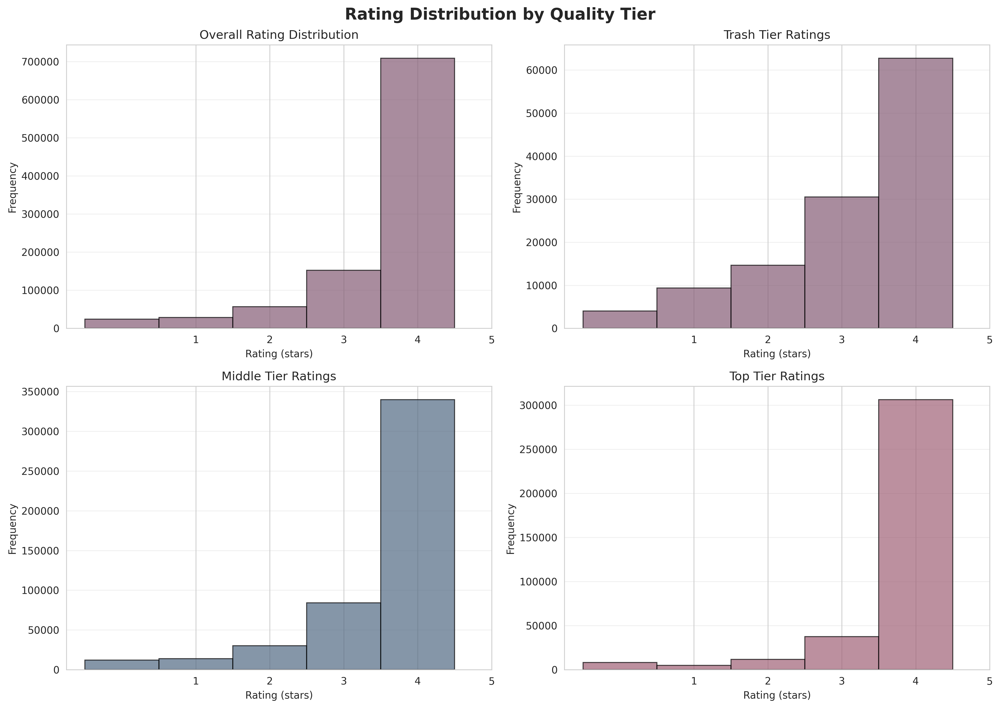
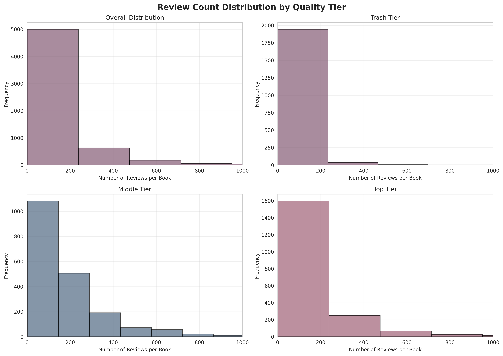
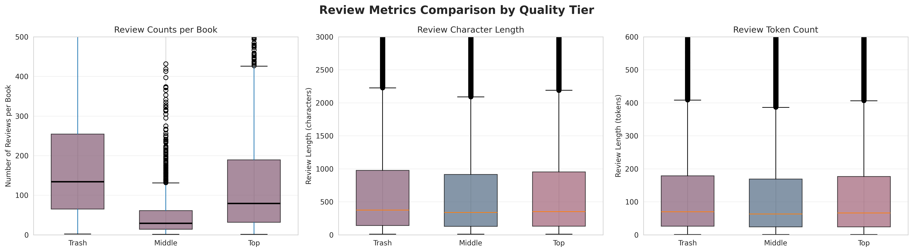

# Phase 3 EDA: Romance Review Data — Completion Summary

## Overview

Phase 3 EDA examined the distribution of Goodreads review data across three romance quality tiers (trash, middle, top) to assess review coverage per book and characterize basic patterns in ratings and text length before topic modeling. The analysis processed 969,675 reviews from 5,998 books in the 6,000-book subdataset, confirming near-complete coverage (99.97%) and revealing clear tier-based differences in review volume and ratings.

## Implementation Notes

- **Stopword refinement**: Removed "story" from stopwords while retaining "characters" and "plot" as content words to preserve semantic information relevant for topic modeling.
- **Subplot indexing fix**: Corrected subplot positioning by implementing a `tier_positions` list to properly map tier visualizations across the 2×2 grid layouts.
- **Memory management**: Replaced `plt.show()` calls with `plt.close()` after each figure save to prevent memory accumulation during batch visualization generation.

## Key Visualizations

The following visualizations provide the most informative evidence for tier-based patterns:

*Rating distributions (1–5 stars) overall and by tier, demonstrating the expected quality gradient: trash (M = 3.35) → middle (M = 3.89) → top (M = 4.27).*

*Review count distributions overall and by tier, revealing substantial differences in review volume: trash (M = 60.7/book) → middle (M = 240.1/book) → top (M = 184.2/book).*

*Side-by-side boxplots comparing review counts per book, character length, and token count across tiers, showing consistent median lengths (63–70 tokens) but substantial volume differences.*

### Additional Outputs

- **review_length_chars_distribution.png**: Character length distributions overall and by tier, showing similar median lengths (~338–375 chars) but different tail behaviors.
- **review_length_tokens_distribution.png**: Token count distributions overall and by tier, with medians ranging from 63–70 tokens per review.
- **summary_statistics.csv**: Tabular summary of key metrics (review counts, lengths, ratings) aggregated by tier.

## Key Quantitative Findings

**Trash tier** (1,999 books): 121,343 total reviews, mean 60.7 reviews per book, mean rating 3.35. Lowest review volume and lowest ratings.

**Middle tier** (2,000 books): 480,126 total reviews, mean 240.1 reviews per book, mean rating 3.89. Highest review volume per book, intermediate ratings.

**Top tier** (1,999 books): 368,206 total reviews, mean 184.2 reviews per book, mean rating 4.27. High review volume (though lower than middle tier), highest ratings.

The data confirms a clear gradient: review volume increases from trash to middle (4× increase), then decreases slightly from middle to top, while ratings increase monotonically from trash (3.35) to middle (3.89) to top (4.27). Middle-tier books attract the most reviews per book on average, while top-tier books receive the highest ratings.

## Implications for Next Steps

These patterns validate the tier stratification and suggest that BERTopic modeling should account for substantial differences in review volume across tiers. The middle tier's high review count (mean 240.1 per book) provides a rich corpus for topic extraction, while the top tier's combination of high ratings and substantial volume (mean 184.2 reviews per book) may reveal distinct thematic patterns associated with highly-rated romance novels. The gradient in ratings (trash < middle < top) suggests that topic modeling may capture lexical and thematic differences that correlate with quality assessment, which can be explored through tier-stratified topic models or tier as a metadata variable in the BERTopic pipeline.

The similar median review lengths across tiers (63–70 tokens) indicate that length-based filtering can be applied uniformly, while the tier differences in total volume suggest that sampling strategies may be needed to balance representation if modeling across all tiers simultaneously.

## Summary Statistics

| Tier | Books | Total Reviews | Mean Reviews/Book | Mean Rating |
|------|-------|---------------|-------------------|-------------|
| Trash | 1,999 | 121,343 | 60.7 | 3.35 |
| Middle | 2,000 | 480,126 | 240.1 | 3.89 |
| Top | 1,999 | 368,206 | 184.2 | 4.27 |
| **Total** | **5,998** | **969,675** | **161.6** | **3.89** |

